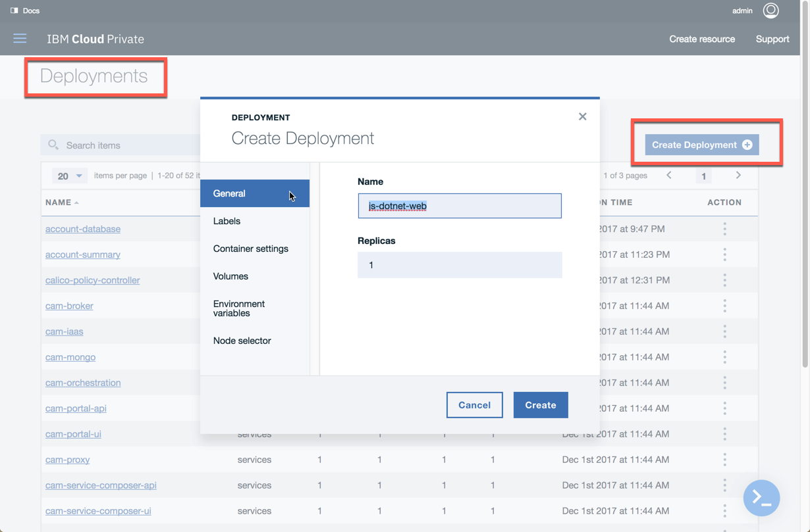
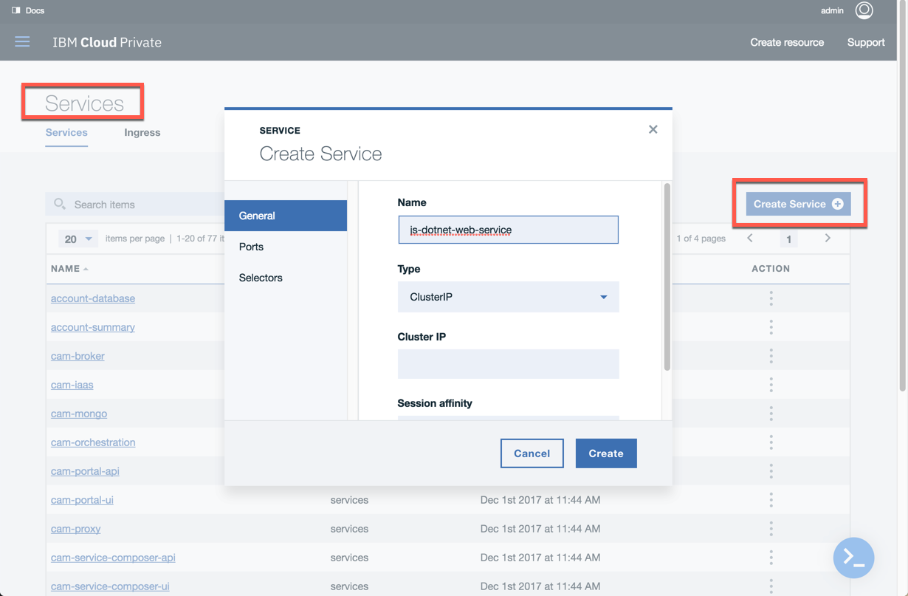
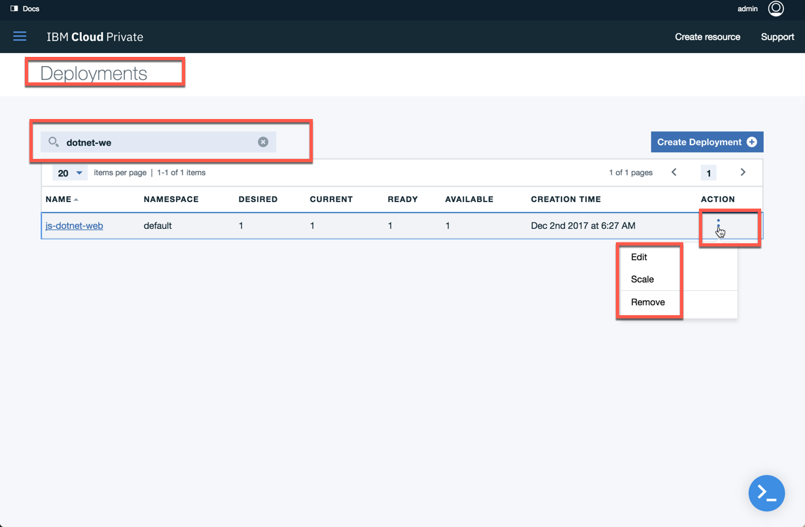
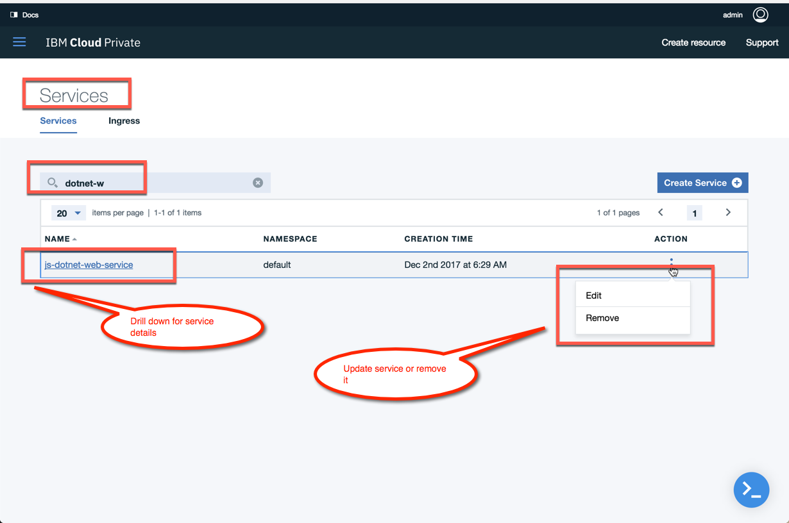
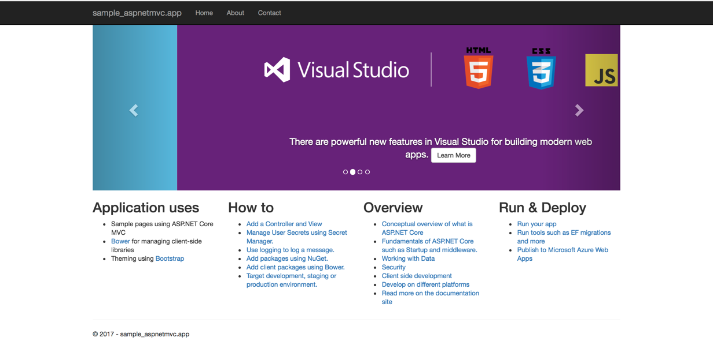

# Build, Test and Deploy a docker ASPNET MVC Core application

Create an application .NET core application locally.

# Create sample application

```
$ mkdir sample_aspnetmvc
$ cd sample_aspnetmvc
$ mkdir sample_aspnetmvc.app
$ cd sample_aspnetmvc.app
$ dotnet new mvc
$ dotnet build
$ dotnet run
```

# Test the application

```
curl -I http://localhost:5000
```
## output
```
HTTP/1.1 200 OK
Date: Fri, 01 Dec 2017 03:28:53 GMT
Content-Type: text/html; charset=utf-8
Server: Kestrel
```

# Create a test project
From the project directory "**sample_aspnetmvc**"

```
$ mkdir sample_aspnetmvc.test
$ cd sample_aspnetmvc.test
$ dotnet new xunit
$ dotnet add reference ../sample_aspnetmvc.app/sample_aspnetmvc.app.csproj
$ dotnet test
```

# Create a Dockerfile

```
FROM microsoft/dotnet:2.0-sdk AS build-env

WORKDIR /solution

COPY sample_aspnetmvc.app/*.csproj ./sample_aspnetmvc.app/
RUN ls sample_aspnetmvc.app/
RUN dotnet restore ./sample_aspnetmvc.app/sample_aspnetmvc.app.csproj

COPY sample_aspnetmvc.test/*.csproj ./sample_aspnetmvc.test/
RUN dotnet restore ./sample_aspnetmvc.test/sample_aspnetmvc.test.csproj

COPY . .

RUN dotnet test ./sample_aspnetmvc.test/sample_aspnetmvc.test.csproj

RUN dotnet publish ./sample_aspnetmvc.app/sample_aspnetmvc.app.csproj --output /out/ --configuration Release

FROM microsoft/aspnetcore

WORKDIR /app
COPY --from=build-env /out .
ENTRYPOINT ["dotnet", "sample_aspnetmvc.app.dll"]
```

# Build the docker image

```
docker build . -t aspnetmvcapp
```

# Run the docker image
```
docker run -p 5000:80 aspnetmvcapp
```

test it as documented above
```
curl -I http://localhost:5000
```

# Push the image to ICP image repo
**Notes**
- specify your master IP in your /etc/hosts file

## login to docker
```
docker login mycluster.icp:8500
```

## tag the image
```
docker tag aspnetmvcapp mycluster.icp:8500/jaricdev/aspnetmvcapp:1.0
```

## push the image
```
docker push mycluster.icp:8500/jaricdev/aspnetmvcapp:1.0
```

# Deploy the image
To deploy the image pushed to private repo of [IBM Cloud private](https://www.ibm.com/cloud-computing/products/ibm-cloud-private/), from the menu Workloads/Deployments enter the following information in the 'Create Deployment' dialog.

General Tab

name | value
-----| -----
Name | js-dotnet-web

Container settings Tab

name | value
-----| -----
Name | js-dotnet-web
Image | mycluster.icp:8500/jaricdev/aspnetmvcapp:1.0
Container port | 80



# Expose the deployment with Service

General Tab

name | value
-----| -----
Name | js-dotnet-web-service
Type | NodePort

Ports Tab

name | value
-----| -----
TCP | http, 5000, 80

Selectors Tab

name | value
-----| -----
app | js-dotnet-web



# Operation on application deployed
You can deploy new version of image, rollback, scale and remove your deployment from the deployment dashboard. Search for your application and click on the vertical ellipsis "..." as shown below.



# Access the application
You can access your application from Service dashboard, search for your application and from there you can find your application endpoint and remove the service.



## the .net application
Below shows the application running in [IBM Cloud private](https://www.ibm.com/cloud-computing/products/ibm-cloud-private/)



## helm Chart

### Create Helm Chart
```
helm create donet-app
```

### Package Helm Chart
```
helm package dotnet-app
```

### Deploy Helm Chart
```
helm install dotnet-app --name js-dotnet-app
```

### List of Chart
```
helm ls --all js-dotnet-app
```

### Remove Helm Chart
```
helm del --purge js-dotnet-app
```

### the chart URL
the custom chart [dotnet-app-0.1.0.tgz](https://github.com/ibmcloudprivate2/mycharts/tree/master/docs)

# Troubleshooting
## incompatiable version
if you encountered the following error during helm install
```
helm install dotnet-app --name js-dotnet-app
Error: incompatible versions client[v2.8.1] server[v2.6.0]
```
to resovle the issue, you will need to download [helm 2.6.2](https://github.com/kubernetes/helm/releases/tag/v2.6.2) to downgrade your helm version.

1. Download your desired version
2. Unpack it (tar -zxvf helm-v2.0.0-linux-amd64.tgz)
3. Find the helm binary in the unpacked directory, and move it to its desired destination (mv linux-amd64/helm /usr/local/bin/helm)


# References
- [ICP introduction](https://www.ibm.com/support/knowledgecenter/en/SSBS6K_2.1.0/getting_started/introduction.html)
- [IBM reference architecture](https://www.ibm.com/cloud/garage/content/think/practice_get_started_with_architectures/)
- [here you will find dashboard of ref architecture](https://www.ibm.com/cloud/garage/category/architectures)
- [specifically for microservice architecture](https://www.ibm.com/cloud/garage/content/architecture/microservices)
- [samples on cloud code patterns](https://developer.ibm.com/code/patterns/category/cloud/)
- [helm charts](https://docs.helm.sh/)
- [ibm charts](https://github.com/IBM/charts)
- [k8s open charts](https://github.com/kubernetes/charts)
- [convert json to yaml](https://www.json2yaml.com/)
